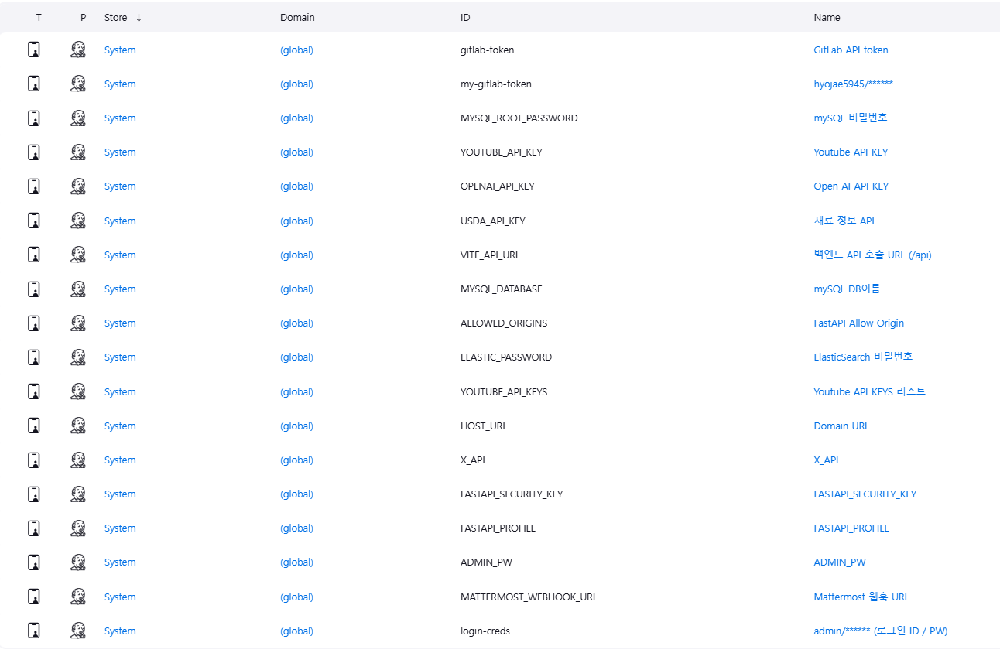
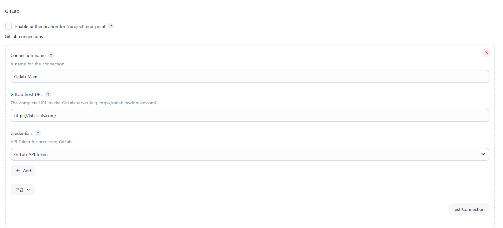
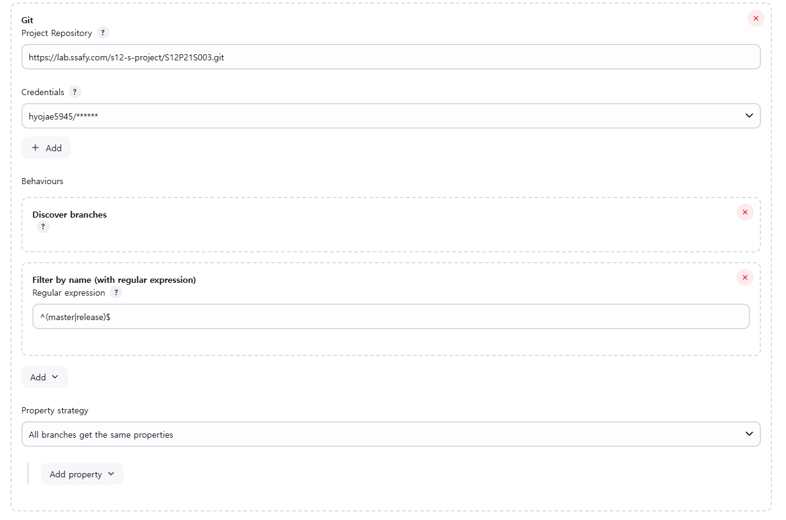

# 포팅 매뉴얼

## 1️⃣ 개요 및 목적

삼성전자 DA 사업부 연계로 진행한 프로젝트로 **'LLM을 이용한 냉장고 고내 재료 기반 레시피 추천 서비스'**<br>
AI 냉장고와 연계하여 고내 재료 기반으로 사용자가 쉽게 레시피를 찾아 이용할 수 있습니다.<br>

## 2️⃣ 시스템 아키텍처 및 구성요소

<!--  -->

## 3️⃣ 환경 요구사항

### Frontend

| Skill                | Version |
| -------------------- | ------- |
| Yarn Berry           | 4.6.0   |
| React                | 18.3.1  |
| TypeScript           | 5.6.2   |
| Zustand              | 5.0.3   |
| Tanstack-query       | 5.68.0  |
| react-player         | 2.16.0  |
| react-dom            | 18.3.1  |
| Axios                | 1.7.9   |
| qrcode.react         | 4.2.0   |
| react-error-boundary | 5.0.0   |
| react-router-dom     | 7.1.1   |

### Backend

#### Spring Boot

| Skill            | Version |
| ---------------- | ------- |
| Java             | 17      |
| JPA              | 3.4.3   |
| SpringBoot       | 3.4.3   |
| SpringSecurity   | 6.4.3   |
| QueryDSL         | 5.0.0   |
| Webflux          | 6.2.3   |
| ElasticSearch    | 5.4.3   |
| Swagger          | 2.8.4   |
| Jwt              | 0.11.5  |
| SpringValidation | 8.0.2   |

#### FastAPI

| Skill   | Version |
| ------- | ------- |
| Python  | 3.11    |
| FastAPI | 0.115.8 |

### INFRA

| Skill          | Version   |
| -------------- | --------- |
| AWS EC2        | t2.xlarge |
| MySQL          | 8.4.4     |
| Docker         | 28.0.1    |
| Docker-compose | 2.33.1    |
| Jenkins        | 2.492.2   |
| NginX          | 1.26.3    |
| ElasticSearch  | 7.17.3    |
| Kibana         | 7.17.3    |

## 📌 EC2 포트 번호

| Skill                   | Port (External:Internal) |
| ----------------------- | ------------------------ |
| NGINX + Front-end build | 80:80/443                |
| SpringBoot(release)     | 8080:8080                |
| SpringBoot(master)      | 8082:8080                |
| FastAPI(release)        | 8000:8000                |
| FastAPI(master)         | 8001:8000                |
| MySQL(release, master)  | docker-network           |
| ElasticSearch           | 9200:9200                |
| Kibana                  | 5601:5601                |
| Jenkins                 | 8081:8081                |

## EC2 설정

### 0. EC2 Terminal 접속

발급받은 .pem키가 있는 폴더에서 bash 같은 터미널 프로그램을 실행합니다

```bash
ssh -i J12S003T.pem ubuntu@j12s003.p.ssafy.io
```

### 1. Git, Docker, Docker-compose 설치

```sh
sudo apt update -y && sudo apt upgrade -y
sudo apt install -y git
git --version  # 설치 확인
# 필수 패키지 설치
sudo apt install -y ca-certificates curl gnupg

# Docker 공식 GPG 키 추가
sudo install -m 0755 -d /etc/apt/keyrings
curl -fsSL https://download.docker.com/linux/ubuntu/gpg | sudo tee /etc/apt/keyrings/docker.asc > /dev/null
sudo chmod a+r /etc/apt/keyrings/docker.asc

# Docker 저장소 추가
echo "deb [arch=$(dpkg --print-architecture) signed-by=/etc/apt/keyrings/docker.asc] https://download.docker.com/linux/ubuntu $(lsb_release -cs) stable" | sudo tee /etc/apt/sources.list.d/docker.list > /dev/null

# 패키지 목록 업데이트 및 Docker 설치
sudo apt update -y
sudo apt install -y docker-ce docker-ce-cli containerd.io docker-buildx-plugin docker-compose-plugin

# Docker 서비스 실행 및 부팅 시 자동 실행 설정
sudo systemctl start docker
sudo systemctl enable docker

# 현재 사용자를 Docker 그룹에 추가 (재로그인 필요)
sudo usermod -aG docker $USER
newgrp docker  # 변경 적용
docker version  # 설치 확인
# 최신 버전 다운로드
sudo curl -L "https://github.com/docker/compose/releases/latest/download/docker-compose-$(uname -s)-$(uname -m)" -o /usr/local/bin/docker-compose

# 실행 권한 부여
sudo chmod +x /usr/local/bin/docker-compose

# 버전 확인
docker-compose version
```

### 2. git repository 동기화

```bash
# 소스코드 url clone
git clone https://lab.ssafy.com/s12-s-project/S12P21S003.git
```

### 3. SSL 인증서 설치

```sh
# frontend/nginx.conf에 다음과 같이 SSL 인증서를 설정하는 부분이 있습니다
ssl_certificate /etc/letsencrypt/live/j12s003.p.ssafy.io/fullchain.pem;
ssl_certificate_key /etc/letsencrypt/live/j12s003.p.ssafy.io/privkey.pem;

# docker-compose-infra.yml에 보면 volumn으로 SSL 인증서를 nginx에 마운트합니다
volumes:
      - /etc/letsencrypt:/etc/letsencrypt:ro

# 따라서 host의 /etc/letsencrypt 폴더 아래에 SSL 인증서 파일이 존재해야합니다

# ssh 인증서를 설치하는 과정은 80번 포트를 사용중이기 때문에
# nginx가 80번 포트에서 가동중이라면 포트 점유를 해제하고 진행해야합니다
sudo apt install certbot python3-certbot-nginx

# 잘 설치됐는지 확인
certbot --version

# domain-url에 프로젝트 도메인 입력
sudo certbot certonly --standalone -d domain-url
```

## 📌환경 변수 - 설정 및 커스터마이징

### 1. Jenkins Credential 설정


위의 이미지에 게시된 환경변수들 설정을 해줍니다.<br>

- gitlab-token : gitlab api token, 사용자 정보 - Access tokens - 새로운 토큰 발급
- my-gitlab-token : jenkins credential에서 username,password 조합으로 gitlab 사용자 등록
- mysql_root_password, elastic_password : 데이터베이스 비밀번호 설정 **(설정 방법은 하단 참조)**
- open_api_key, youtube_api_keys, allow_origins, x_api, fastapi_profile : ai 폴더의 README.md 참고
- usda_api_key : 식재료 정보 api, https://fdc.nal.usda.gov/api-key-signup 에서 api key 발급하여 사용
- host_url : 서비스의 도메인 주소, 현재는 https://j12s003.p.ssafy.io/
- mattermost_webhook_url : mattermost의 incoming webhook url
- admin_pw : 로그인시 사용할 비밀번호 설정
- login-creds : 프로젝트의 ID/PW, 토큰 발급받기 위해 사용

### 2. Jenkins Plugin 설정

Jenkins 설치시 권장되는 기본플러그인 바탕으로 시작 후 다음과 같은 추가 플러그인 설치<br>

- workspace cleanup plugin
- pipeline utility steps
- gitlab plugin, gitlab api plugin

### 3. Jenkins Gitlab 설정

manage jenkins -> system에서 gitlab 섹션으로 이동<br>

위 그림과 같이 gitlab url과 credentials(미리 설정한 gitlab api token) 설정<br>

### 4. Jenkins multibranch pipeline 생성

새로운 Item으로 multibranch pipeline 클릭하고 이름 설정 후 생성<br>

위 그림과 같이 git project 주소와 이전에 설정한 jenkins의 gitlab credential 설정<br>
하단에 빌드 트리거할 브랜치 다음과 같이 설정(ex. master, release)후 save버튼 클릭<br>

### 5. Gitlab webhook 설정

jenkins multibranch pipeline 생성시 사용한 job 이름을 기반으로 gitlab webhook 생성<br>
trigger에 push event 선택 후 regular expression에서 트리거 브랜치 설정<br>
하단의 test버튼으로 정상작동하는지 확인<br>

## 서비스 실행

### 인프라(nginx, mysql)

```sh
cd S12P11B102
MYSQL_ROOT_PASSWORD='설정하고픈 PW' docker-compose -f docker-compose-infra.yml up -d --build
```

인프라의 컨테이너는 항상 가동중이기 때문에 실행할때 password 설정해줍니다다<br>

### db database 생성

```sh
docker exec -it my-mysql-${BRANCH_NAME} mysql -u root -p
```

입력 후 미리 설정한 password로 로그인<br>

```
create database recipidia
```

사용할 database을 만들어줍니다<br>

### ElasticSearch, kibana

```sh
docker-compose -f docker-compose-es.yml up -d --build
```

### ES 및 Kibana 초기설정

#### ES password 초기 세팅
```sh
docker exec -it my-elasticSearch /bin/bash

# password 설정 interactive 환경 입장
# 여기서 password를 지정
bin/elasticsearch-setup-passwords interactive

docker restart my-elasticSearch
```

#### kibana에 es password 전달하며 docker 컨테이너 실행
```sh
ELASTICSEARCH_PASSWORD="MY_PASSWORD" docker-compose -f docker-compose-es.yml up -d
```
이후 컨테이너가 모두 정상적으로 가동됐는지 확인<br>
`domain:5601`로 접근하여 ID : elastic, PW : 미리 설정한 PW로 kibana 입장<br>
좌상단에 메뉴를 누르고 하단에 Dev Tools에 입장해서 다음과 같은 명령어 실행<br>

```json
// kibana 전체 인덱스 확인
GET _cat/indices?v

// 현재 kibana 인덱스 설정 확인
GET ingredient/_settings

// kibana 인덱스 설정 세팅
PUT ingredient
{
  "settings": {
    "analysis": {
      "analyzer": {
        "korean_exact_analyzer": {
          "type": "custom",
          "tokenizer": "standard"
        }
      }
    }
  },
  "mappings": {
    "properties": {
      "id": { "type": "keyword" },
      "name": {
        "type": "text",
        "analyzer": "korean_exact_analyzer",
        "search_analyzer": "korean_exact_analyzer"
      }
    }
  }
}

// 인덱스 설정 잘 됐는지 확인
GET ingredient/_settings
```

### Jenkins CI/CD 파이프라인
#### 프로젝트 가동하는 방법<br>
1. 지정된 브랜치(master/release)에 merge/push 이벤트가 발생한 Jenkinsfile 실행됌
2. Jenkins UI dashboard에서 생성한 multibranch-pipeline 들어간 후 "직접 빌드"를 클릭한다 (이 방법 추천, git repo에 접근권한 없을 수 있으니)

```sh
docker ps -a
```

위 명령어 결과 모든 컨테이너가 정상이면 domain(https://j12s003.p.ssafy.io/)으로 접속시 서비스 접속 가능

## 번외

### 식재료 검색이 안될 시(Elastic Search가 안될시)

먼저 domain:5601로 접속하여 kibana devtools에 접속합니다<br>
`GET _cat/indices?v` 로 index를 확인합니다<br>
ingredient index가 비어있을 시 DB에 접속해 ingredient 테이블의 데이터를 전부 지워줍니다(drop table)<br>
그 후 다음 셋중 하나의 행동을 취합니다<br>

1. docker restart my-springboot-${BRANCH_NAME}
2. docker-compose -f docker-compose-app.yml up -d --build
3. 해당 브랜치를 기준으로 젠킨스 재 빌드

이후 위의 kibana 명령어를 다시 반복한 후 ingredient index가 채워져있으면(200이상) 정상작동 됩니다
